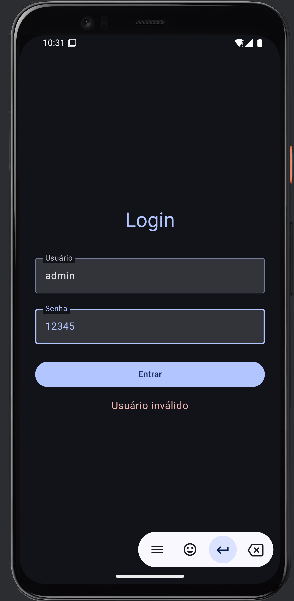

# GS - Android Kotlin - 2 SEM

## Integrantes
- Daniel Marin Palma - rm551738
- Carolina Teixeira Coelho - rm97643

### Telas Funcionando:

 1. Login

 
 Para logar 
    user = admin
    senha = 123456

2. Menu

3. IMC

4. Integrantes

### Link do Github:
- https://github.com/caroolt/gs-kotlin-2-sem
